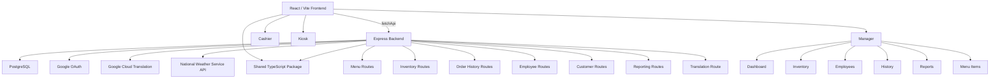

# Restaurant POS System

A full-stack restaurant Point-of-Sale (POS) system built with **React, TypeScript, Node.js, Express, PostgreSQL, and Tailwind CSS**. The application provides separate cashier, customer kiosk, and manager workflows for processing orders, managing inventory and menu items, tracking customers and loyalty points, reviewing order history, and analyzing sales.

> **Repository:** https://github.com/jasonlau05/pos_system

## Table of Contents

- [Overview](#overview)
- [Features](#features)
- [Technology Stack](#technology-stack)
- [Architecture](#architecture)
- [Project Structure](#project-structure)
- [Application Workflows](#application-workflows)
- [Getting Started](#getting-started)
- [Environment Variables](#environment-variables)
- [Database Requirements](#database-requirements)
- [Running the Application](#running-the-application)
- [Building for Production](#building-for-production)
- [Application Routes](#application-routes)
- [API Overview](#api-overview)
- [Authentication](#authentication)
- [Orders, Inventory, and Loyalty](#orders-inventory-and-loyalty)
- [Localization and Accessibility](#localization-and-accessibility)
- [Weather Integration](#weather-integration)
- [Automated Fake Orders](#automated-fake-orders)
- [Security](#security)
- [Deployment Notes](#deployment-notes)
- [Development Guide](#development-guide)
- [Troubleshooting](#troubleshooting)
- [Known Limitations](#known-limitations)
- [Contributing](#contributing)
- [License](#license)

## Overview

This project is a web-based restaurant POS platform organized as a small monorepo with three workspaces:

- **`frontend`** — React/Vite client application
- **`backend`** — TypeScript/Express API server
- **`shared`** — Types, constants, and utility definitions shared by the frontend and backend

The frontend communicates with the backend through a small typed API wrapper. The backend uses PostgreSQL through the `pg` package and maintains a connection pool. Checkout operations are executed inside PostgreSQL transactions so inventory deduction and order creation can be committed or rolled back together.

## Features

### Cashier POS

The cashier interface is designed for employee-operated checkout and includes:

- Menu browsing by category
- Shopping cart management
- Quantity adjustments
- Drink customization
- Size, sweetness, ice, temperature, and topping selections
- Cash or card payment selection
- Tax and total calculation
- Employee authentication
- Dark/light mode
- Language switching
- Weather display

The shared configuration currently uses a **8.25% sales tax rate**, USD currency formatting, a $0.50 topping price, and size modifiers of **-$1.00 / $0 / +$1.25** for small/medium/large drinks.

### Customer Self-Service Kiosk

The `/kiosk` experience provides a customer-facing ordering flow with additional customer-oriented features:

- Guest ordering
- Customer/member lookup
- Registration using phone or email
- Google customer authentication
- Loyalty point balance and redemption flow
- Past-order lookup
- Drink customization
- Cart and checkout functionality
- Text-to-speech support
- Font-size controls
- High-contrast mode
- Language selection
- Visual checkout feedback/confetti

### Manager Dashboard

The manager interface combines multiple operational tools behind an authenticated route:

- Dashboard KPIs and sales trends
- Inventory management
- Employee management
- Order history
- Sales/reporting views
- Menu-item management
- Weather display
- Theme and language controls

Manager navigation is implemented as tabbed content under `/manager`, with the current tab persisted in the URL query string.

### Inventory Management

The backend supports inventory CRUD operations and additional inventory relationships:

- List inventory items
- Add inventory items
- Update inventory items
- Delete inventory items
- Manually deduct inventory for waste or other adjustments
- View which menu items use an ingredient
- Associate ingredient stock with menu items through the `drinkjointable` relationship

Checkout also performs an inventory availability check before deducting stock.

### Menu Management

Menu items can be:

- Listed
- Created
- Updated
- Deleted
- Associated with inventory ingredients
- Displayed with categories, images, and descriptions

The menu API also aggregates inventory ingredients marked for display in a menu item's description.

### Customer Loyalty

Customer records support:

- Name
- Phone number
- Email
- Google account identifier
- Loyalty points
- Signup date
- Past orders

Customers currently receive **10 points per dollar spent** during an order. New customers are initialized with **50 points**.

## Technology Stack

| Layer | Technology |
| --- | --- |
| Frontend | React 18 + TypeScript |
| Frontend build tool | Vite |
| Frontend routing | React Router |
| Styling | Tailwind CSS |
| UI primitives | Radix UI |
| Animations | Framer Motion / Motion |
| Icons | Lucide React |
| Internationalization | i18next + react-i18next |
| Backend | Node.js + Express |
| Backend language | TypeScript |
| Database | PostgreSQL |
| Database client | `pg` |
| Authentication | Express sessions, bcrypt, Google OAuth token verification |
| Translation | Google Cloud Translation API |
| Weather | `api.weather.gov` |
| Frontend deployment support | Vercel configuration included |
| CI/automation | GitHub Actions |

## Architecture



### Request Flow

A typical checkout follows this pattern:

1. The frontend loads menu data from `GET /api/menu`.
2. The user adds items to the cart and optionally customizes drinks.
3. The cart calculates subtotal, tax, and total using shared functions.
4. Checkout sends the order to `POST /api/order-history`.
5. The backend validates the request and checks inventory availability.
6. A database transaction creates the order records and deducts inventory.
7. If a customer is attached to the order, loyalty points and total spending are updated in the same transaction.
8. A successful response returns the generated order ID.

## Project Structure

```text
pos_system/
├── .github/
│   └── workflows/
│       └── generate-fake-orders.yaml
├── backend/
│   ├── src/
│   │   ├── services/
│   │   ├── scripts/
│   │   ├── utils/
│   │   ├── customerRoutes.ts
│   │   ├── employeeRoutes.ts
│   │   ├── inventoryRoutes.ts
│   │   ├── menuRoutes.ts
│   │   ├── orderHistoryRoutes.ts
│   │   ├── reportsRoutes.ts
│   │   ├── salesReportRoutes.ts
│   │   ├── translateRoutes.ts
│   │   ├── db.ts
│   │   └── server.ts
│   ├── package.json
│   └── tsconfig.json
├── frontend/
│   ├── public/
│   ├── src/
│   │   ├── components/
│   │   ├── contexts/
│   │   ├── hooks/
│   │   ├── lib/
│   │   ├── locales/
│   │   ├── App.tsx
│   │   ├── Cashier.tsx
│   │   ├── DashboardPage.tsx
│   │   ├── EmployeesPage.tsx
│   │   ├── HistoryPage.tsx
│   │   ├── InventoryPage.tsx
│   │   ├── Kiosk.tsx
│   │   ├── Login.tsx
│   │   ├── Manager.tsx
│   │   ├── MenuPage.tsx
│   │   ├── Menuboards.tsx
│   │   └── ReportsPage.tsx
│   ├── package.json
│   ├── tailwind.config.js
│   ├── vite.config.ts
│   └── vercel.json
├── shared/
│   ├── src/
│   │   ├── constants.ts
│   │   ├── index.ts
│   │   └── types.ts
│   └── package.json
├── package.json
├── package-lock.json
└── tsconfig.json
```

## Application Workflows

### Employee Workflow

```text
Login
  ↓
Authenticated Session
  ↓
Cashier OR Manager
  ├── Cashier → Menu → Cart → Checkout → Order History / Inventory Update
  └── Manager → Dashboard / Inventory / Employees / History / Reports / Menu
```

Employee authentication supports both:

- Email/password login backed by the `employees` table
- Google OAuth token verification

Sessions are stored through `express-session` and sent to the browser using HTTP-only cookies.

### Customer Workflow

```text
Guest / Member
  ↓
Browse Menu
  ↓
Customize Items
  ↓
Cart
  ↓
Optional Member Login / Registration
  ↓
Redeem or Earn Loyalty Points
  ↓
Checkout
  ↓
Order Confirmation
```

## Getting Started

### Prerequisites

Install the following before running the project:

- Node.js with a version compatible with the installed dependencies
- npm
- PostgreSQL
- A PostgreSQL database populated with the schema expected by the backend
- Google OAuth credentials if Google authentication is required
- A Google Cloud Translation API key if translation functionality is required

### 1. Clone the repository

```bash
git clone https://github.com/jasonlau05/pos_system.git
cd pos_system
```

### 2. Install dependencies

The repository uses npm workspaces for `frontend`, `backend`, and `shared`.

```bash
npm install
```

Installing from the repository root is preferred because the root workspace configuration coordinates the three packages.

### 3. Configure environment variables

Create the backend environment file and populate the required variables described below. For local development, a typical setup uses the backend at `http://localhost:3000` and the Vite frontend at `http://localhost:5173`.

### 4. Start the development servers

From the repository root:

```bash
npm run dev
```

The root `dev` script uses `concurrently` to launch both workspace development servers.

By default:

- Frontend: `http://localhost:5173`
- Backend: `http://localhost:3000`
- Backend health check: `http://localhost:3000/health`

## Environment Variables

### Backend

| Variable | Required | Description | Default / Notes |
| --- | --- | --- | --- |
| `DB_HOST` | Yes | PostgreSQL host | Required by `db.ts` |
| `DB_NAME` | Yes | PostgreSQL database name | Required by `db.ts` |
| `DB_USER` | Yes | PostgreSQL username | Required by `db.ts` |
| `DB_PASSWORD` | Yes | PostgreSQL password | Required by `db.ts` |
| `DB_PORT` | No | PostgreSQL port | Defaults to `5432` |
| `DB_SSL` | No | Enables PostgreSQL SSL | Set to `true` for SSL mode |
| `PORT` | No | Express server port | Defaults to `3000` |
| `NODE_ENV` | No | Runtime environment | `production` enables production cookie behavior |
| `FRONTEND_URL` | No | Allowed frontend origins | Defaults to `http://localhost:5173`; multiple origins can be comma-separated |
| `SESSION_SECRET` | Production | Session signing secret | Required in production |
| `GOOGLE_CLIENT_ID` | Google auth | Google OAuth client ID | Required for Google employee/customer auth |
| `GOOGLE_TRANSLATE_API_KEY` | Translation | Google Cloud Translation API key | Required by `/api/translate` |

### Frontend

| Variable | Required | Description | Default / Notes |
| --- | --- | --- | --- |
| `VITE_API_URL` | No | Backend base URL | Preferred frontend API setting |
| `VITE_BACKEND_URL` | No | Alternate backend base URL | Used when `VITE_API_URL` is unset |

The frontend API helper resolves the backend URL in this order:

1. `VITE_API_URL`
2. `VITE_BACKEND_URL`
3. `http://localhost:3000`

Do not commit secrets or production credentials to the repository.

## Database Requirements

The backend expects an existing PostgreSQL schema. The current code references the following tables and relationships:

- `employees`
- `inventory`
- `menuitems`
- `drinkjointable`
- `customers`
- `order_history`

The `drinkjointable` table connects menu items to inventory ingredients and stores recipe quantities.

The application uses PostgreSQL connection pooling with:

- Maximum pool size: `20`
- Idle timeout: `30s`
- Connection timeout: `10s`
- Optional SSL support through `DB_SSL=true`

The backend also exposes a transaction helper that performs `BEGIN`, `COMMIT`, and `ROLLBACK` around multi-step operations.

> **Important:** The repository currently does not include a database migration/schema file. A fresh PostgreSQL instance therefore requires the corresponding database schema before the application can function correctly.

## Running the Application

### Development

Run both services together:

```bash
npm run dev
```

Run only the frontend:

```bash
npm run dev --workspace frontend
```

Run only the backend:

```bash
npm run dev --workspace backend
```

### Frontend preview

Build the frontend and serve the Vite production build locally:

```bash
npm run build --workspace frontend
npm run preview --workspace frontend
```

### Backend production mode

Build the backend:

```bash
npm run build --workspace backend
```

Start the compiled server:

```bash
npm run start --workspace backend
```

### Build everything

The root build script builds packages in dependency order:

```bash
npm run build
```

The order is:

```text
shared → backend → frontend
```

This is important because both the backend and frontend depend on the shared workspace package.

## Application Routes

The React application defines these primary client routes:

| Route | Access | Purpose |
| --- | --- | --- |
| `/` | Public | Login page |
| `/login` | Public | Login page |
| `/kiosk` | Public | Customer self-service POS |
| `/menuboards` | Public | Menu board display |
| `/cashier` | Authenticated | Employee cashier interface |
| `/manager` | Authenticated | Manager/admin interface |

Authentication is enforced by the frontend `ProtectedRoute` wrapper for `/cashier` and `/manager`.

## API Overview

The backend mounts the following API routers:

| Base route | Responsibility |
| --- | --- |
| `/api/menu` | Menu item retrieval and CRUD; ingredient associations |
| `/api/inventory` | Inventory retrieval, CRUD, usage, and deductions |
| `/api/order-history` | Create orders and retrieve paginated order history |
| `/api/sales-report` | Sales reporting data |
| `/api/employees` | Employee CRUD |
| `/api/reports` | Dashboard/reporting data |
| `/api/customers` | Customer lookup, registration, Google login, past orders |
| `/api/translate` | Batched Google Translation requests |

Additional backend routes include:

| Route | Purpose |
| --- | --- |
| `GET /health` | Confirms the server is running and PostgreSQL is reachable |
| `POST /auth/google/verify` | Employee Google credential verification |
| `POST /auth/login` | Employee email/password login |
| `POST /auth/signup` | Creates a new employee account |
| `GET /auth/user` | Returns the current authenticated employee |
| `POST /auth/logout` | Destroys the current employee session |
| `GET /api/weather/current` | Returns cached current weather data |
| `POST /internal/generate-fake-orders` | Generates fake orders for development/demo data |

### API Response Format

The shared package defines a common response shape:

```ts
// Success
{
  success: true,
  data: T,
  message?: string
}

// Error
{
  success: false,
  message: string,
  code?: string
}
```

The frontend `fetchApi()` helper validates this response structure and returns `data` directly on success.

## Authentication

### Employee Authentication

Employee authentication supports:

- Email/password authentication
- Google OAuth token verification
- Session-based authentication using `express-session`
- bcrypt password hashing
- Logout/session destruction

In production, session cookies are configured as secure cookies with `SameSite=None`, while local development uses non-secure cookies with `SameSite=Lax`.

### Customer Authentication

Customer accounts can be located by phone number or email and can also be associated with a Google account through the customer Google login endpoint.

Customer authentication is separate from employee authorization and is used primarily by the kiosk flow.

## Orders, Inventory, and Loyalty

### Atomic Checkout

The order creation endpoint performs the major checkout steps inside a database transaction:

1. Validate order items
2. Check inventory availability
3. Allocate a new order ID
4. Insert order line items
5. Deduct inventory
6. Update customer loyalty points and total spending, when applicable
7. Commit the transaction

If a stock check or database operation fails, the transaction is rolled back rather than leaving the order and inventory in an inconsistent state.

### Loyalty Points

The shared constant is:

```ts
POINTS_PER_DOLLAR = 10
```

The current customer registration logic also initializes new customers with `50` points.

### Drink Customization

The shared type model supports:

- Sweetness: `0`, `25`, `50`, `75`, `100`, `125`, `150`, `200`
- Ice: `regular`, `light`, `none`
- Size: `small`, `medium`, `large`
- Temperature: `hot` or `cold`
- Multiple toppings

Customization is serialized with orders so it can be retrieved from order history.

## Localization and Accessibility

The frontend uses `i18next` and `react-i18next` for localization. Menu categories and user-facing labels are mapped to translation keys, and the kiosk includes additional accessibility-oriented controls.

Current UI capabilities visible in the codebase include:

- Language switching
- Dark/light mode
- High-contrast mode in the kiosk
- Adjustable font size in the kiosk
- Text-to-speech support in the kiosk
- Responsive drawer/dialog-based UI components

The frontend also uses Radix UI primitives for dialogs, tabs, select controls, tooltips, and other accessible interaction patterns.

## Weather Integration

The backend exposes a weather proxy at:

```text
GET /api/weather/current
```

It currently requests forecast data from the National Weather Service API and converts the forecast text into a frontend icon category.

The result is cached in memory for **5 minutes**. When the upstream request fails, stale cached data is returned when available.

## Automated Fake Orders

The repository contains a GitHub Actions workflow at:

```text
.github/workflows/generate-fake-orders.yaml
```

The workflow:

- Runs every 8 minutes (UTC)
- Can be triggered manually from GitHub Actions
- Calls the backend's `/internal/generate-fake-orders` endpoint

This is intended to populate the application with demonstration/testing order activity.

### Caution

Because the workflow targets a deployed backend URL, verify that the endpoint is intentionally exposed and protected appropriately before using the workflow in a production environment.

## Security

The backend already includes several security-oriented controls:

- `helmet` security headers
- CORS allow-listing based on `FRONTEND_URL`
- HTTP-only session cookies
- Production secure cookies
- `express-rate-limit`
- bcrypt password hashing
- Google token verification
- Input validation on multiple API routes
- Parameterized PostgreSQL queries in route handlers
- Graceful shutdown and database pool cleanup

### Important security considerations

The current codebase should still be reviewed before production use.

**Employee credential generation:** the employee creation endpoint generates a deterministic email/password from the employee name and returns the generated plaintext password in the response. This is convenient for a class/project environment but should be redesigned for a production POS system.

**Session storage:** `express-session` uses its default in-memory store unless another store is configured. A production deployment with multiple backend instances should use a persistent/shared session store such as Redis or another supported session store.

**Internal fake-order endpoint:** `/internal/generate-fake-orders` is currently callable without an authentication middleware in `server.ts`. It should be restricted or removed before exposing the application publicly in production.

**Translation and weather proxies:** external-service API calls should be rate-limited and monitored according to the requirements of the deployed environment.

## Deployment Notes

### Frontend

The frontend includes `vercel.json` with a catch-all rewrite to `index.html`, which supports client-side React Router navigation when deployed as a single-page application on Vercel.

Typical frontend deployment configuration should provide:

```text
VITE_API_URL=https://<your-backend-domain>
```

### Backend

The backend is a conventional Node/Express service and can be deployed to a Node-compatible host such as Render or another container/server platform.

Production configuration should include at minimum:

```text
NODE_ENV=production
PORT=<platform-provided-port>
SESSION_SECRET=<strong-random-secret>
FRONTEND_URL=https://<your-frontend-domain>
DB_HOST=<postgres-host>
DB_NAME=<database-name>
DB_USER=<database-user>
DB_PASSWORD=<database-password>
DB_PORT=<postgres-port>
DB_SSL=true
```

Google authentication and translation require their respective credentials as well.

### Health Check

Use the health endpoint as a deployment/readiness check:

```bash
curl http://localhost:3000/health
```

A healthy response confirms both that the Express server is running and that the PostgreSQL connection can be queried.

## Development Guide

### Adding a New Shared Type

Add shared interfaces/types to:

```text
shared/src/types.ts
```

Then export them through the shared package entry point if necessary.

### Adding Shared Constants

Application-wide business rules such as tax, loyalty points, pricing modifiers, and category definitions belong in:

```text
shared/src/constants.ts
```

Keeping these values in the shared package prevents frontend/backend business-rule drift.

### Adding a Backend Endpoint

1. Create or update a route module under `backend/src`.
2. Use the shared types where appropriate.
3. Use parameterized PostgreSQL queries.
4. Return the standard success/error response format.
5. Register the router in `backend/src/server.ts`.
6. Update this README's API table if the endpoint is part of the public application surface.

### Adding a Frontend Feature

1. Add reusable UI under `frontend/src/components`.
2. Use hooks/context for cross-page state where appropriate.
3. Use `fetchApi()` instead of duplicating API response handling.
4. Add user-facing strings to the localization resources.
5. Keep shared domain types in `shared` rather than duplicating interfaces.

### Root Commands

| Command | Purpose |
| --- | --- |
| `npm install` | Install all workspace dependencies |
| `npm run dev` | Start frontend and backend concurrently |
| `npm run build` | Build shared, backend, then frontend |
| `npm run start` | Start the compiled backend |
| `npm run typecheck` | Run workspace build dry-run checks |

## Troubleshooting

### `Missing required database environment variables`

The backend refuses to start when any of these are absent:

```text
DB_HOST
DB_NAME
DB_USER
DB_PASSWORD
```

Verify the environment file is being loaded by the backend process.

### Frontend loads but API requests fail

Check that the frontend points to the correct backend:

```text
VITE_API_URL=http://localhost:3000
```

Also verify that the backend's `FRONTEND_URL` contains the exact frontend origin, including scheme and port.

### Google login does not work

Verify:

- `GOOGLE_CLIENT_ID` is configured on the backend
- The same client ID is used by the frontend Google sign-in integration
- Authorized JavaScript origins/redirect settings are correct in Google Cloud
- The OAuth credential is being sent to the appropriate backend endpoint

### Translation is unavailable

The `/api/translate` endpoint returns `503` when `GOOGLE_TRANSLATE_API_KEY` is missing.

### The frontend route returns 404 after refresh

When deployed to a static host, configure a rewrite so application routes resolve to `index.html`. This repository already includes the required Vercel rewrite configuration.

### Checkout fails because of stock

Order creation validates inventory before committing the transaction. Verify the relevant ingredient quantities and the menu-to-inventory relationships in `drinkjointable`.

## Known Limitations

The current repository is structured like a working academic/project POS application rather than a hardened commercial POS deployment. Notable limitations include:

- No migration/schema file is included in the repository.
- No automated application test suite or test script is currently exposed in the workspace package manifests.
- Employee creation currently uses generated credentials derived from the employee name.
- The internal fake-order route is not protected by an explicit authentication middleware.
- The default Express session store is not suitable for horizontally scaled production deployments.
- The weather cache is process-local, so each backend instance maintains its own cache.
- The backend's weather integration currently targets a fixed National Weather Service grid point.

These are appropriate areas for future production hardening.

## Contributing

Contributions are welcome.

Recommended workflow:

```bash
git checkout -b feature/my-change
npm install
npm run build
```

Then commit the change and open a pull request describing:

- What changed
- Why it changed
- How it was tested
- Any database or environment-variable changes
- Any deployment considerations

## License

No license file is currently present in the repository. Unless a license is added, standard copyright restrictions apply to the repository's source code.

## Credits / References

- React: https://react.dev/
- Vite: https://vite.dev/
- Express: https://expressjs.com/
- PostgreSQL: https://www.postgresql.org/
- Tailwind CSS: https://tailwindcss.com/
- Radix UI: https://www.radix-ui.com/
- i18next: https://www.i18next.com/
- Google Identity / OAuth: https://developers.google.com/identity
- Google Cloud Translation: https://cloud.google.com/translate
- National Weather Service API: https://www.weather.gov/documentation/services-web-api
